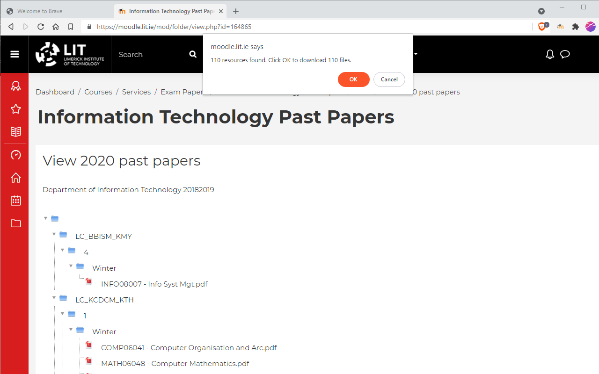

# Moodle File Archive 

A browser extension written in JavaScript.

## Available @

- [Chrome web store](https://chrome.google.com/webstore/detail/moodle-file-archive/difihjamhbmpnhdfomhpegbpbemfkelm)

## Background

To keep a copy of the files on a moodle module you have to download each file, the filename often does not match the file title on the webpage, and the order of the files is not obvious.  The Moodle File Archive extension parses the webpages and downloads the files in the correct order with correct file title.  All the file downloads are initiated at once by clicking on the extension button.

## Notes

This is a work in progress and may not work for all files on a moodle module.

## Requirements

A [Chromium](https://www.chromium.org/Home) based browser such as:

- **[Brave](https://brave.com/)**
- [Google Chrome](https://www.google.com/chrome/)
- [Microsoft Edge](https://www.microsoft.com/en-us/windows/microsoft-edge)
- [Opera](https://www.opera.com/)

## Screenshot

## Tools Used

- [Visual Studio Code](https://code.visualstudio.com/): [CSS](https://code.visualstudio.com/docs/languages/css), [Javascript](https://code.visualstudio.com/docs/languages/javascript), [JSON](https://code.visualstudio.com/docs/languages/json), [HTML](https://code.visualstudio.com/docs/languages/html), [Markdown](https://code.visualstudio.com/docs/languages/markdown)
- [Paint.NET](https://www.getpaint.net/)

---
Copyright &copy; 2021 Mark Crowe <https://github.com/markcrowe-com>. All rights reserved.
